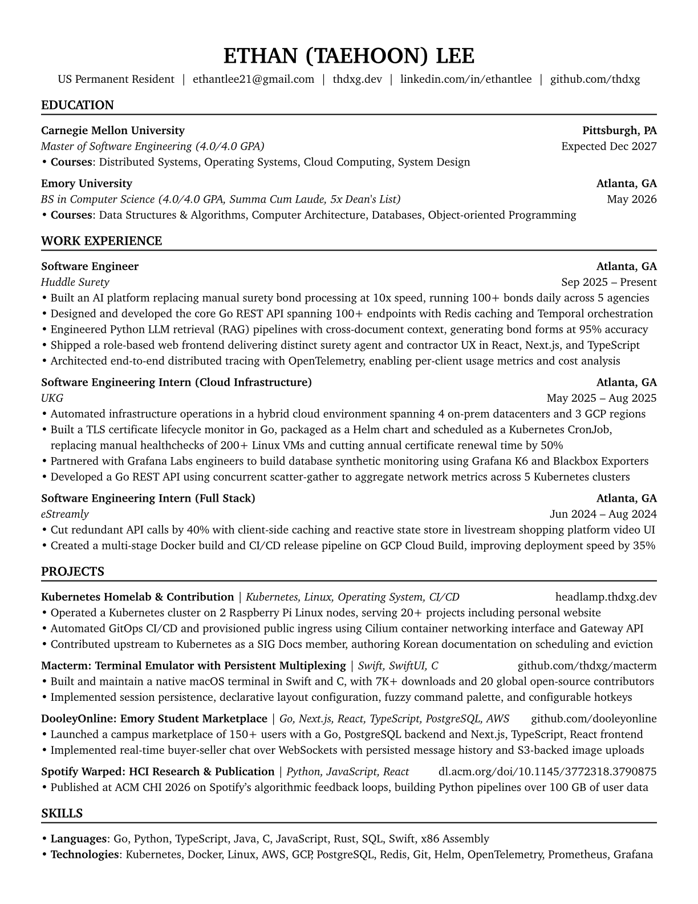

# Resume & Cover Letter

Declarative resume and cover letter built with Typst.

## Preview



## Usage

- Edit resume content in [resume.yaml](./resume.yaml). Each project accepts an
  optional `skills` list, rendered next to the project name after a `|` divider.
- Edit per-application cover letter variables (company, position, motivation)
  in [cover-letter.yaml](./cover-letter.yaml).
- Edit the cover letter greeting and prose in
  [docs/cover-letter.typ](./docs/cover-letter.typ).
- Run `mise run compile` to generate PDF + PNG for both documents.

Compile, preview, or copy a single document:

```
mise run compile:resume
mise run compile:letter
mise run preview:resume
mise run copy:letter
```

`copy:letter` puts the cover letter body on the clipboard as plain text for
pasting into application forms. It reads the paragraphs out of the compiled
document with `typst query`, so `#letter.*` variables are already interpolated;
the header, greeting, and sign-off are dropped.

See [mise.toml](./mise.toml) for all commands.
