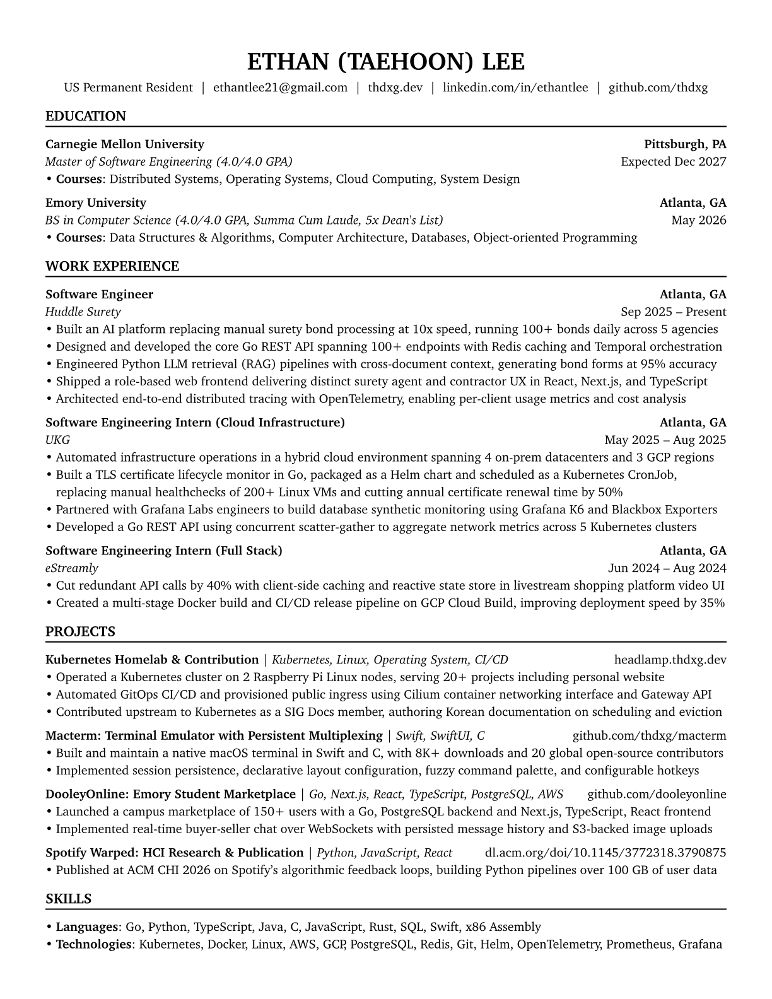

# Resume

Declarative resume built with Typst. Clean, customizable, and ATS-friendly.

## Preview

## Usage

- Edit resume content in [resume.yaml](./resume.yaml). Each project accepts an
  optional `skills` list, rendered next to the project name after a `|` divider.
- Run `mise run compile` to generate the PDF + PNG into `assets/`.
- Run `mise run preview` for a live preview in the browser.

See [mise.toml](./mise.toml) for all commands.
